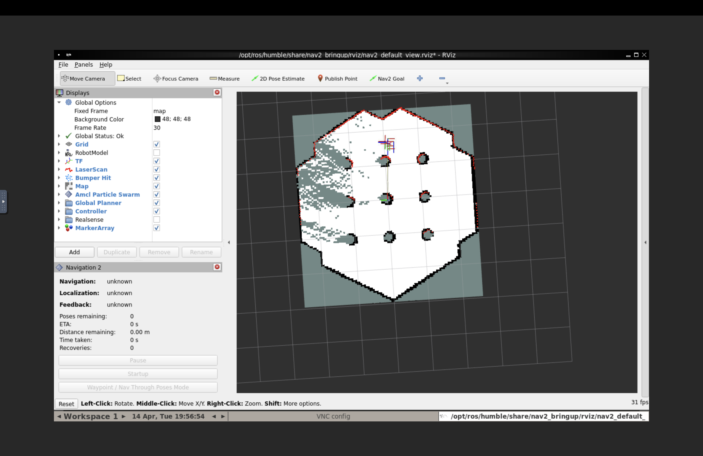
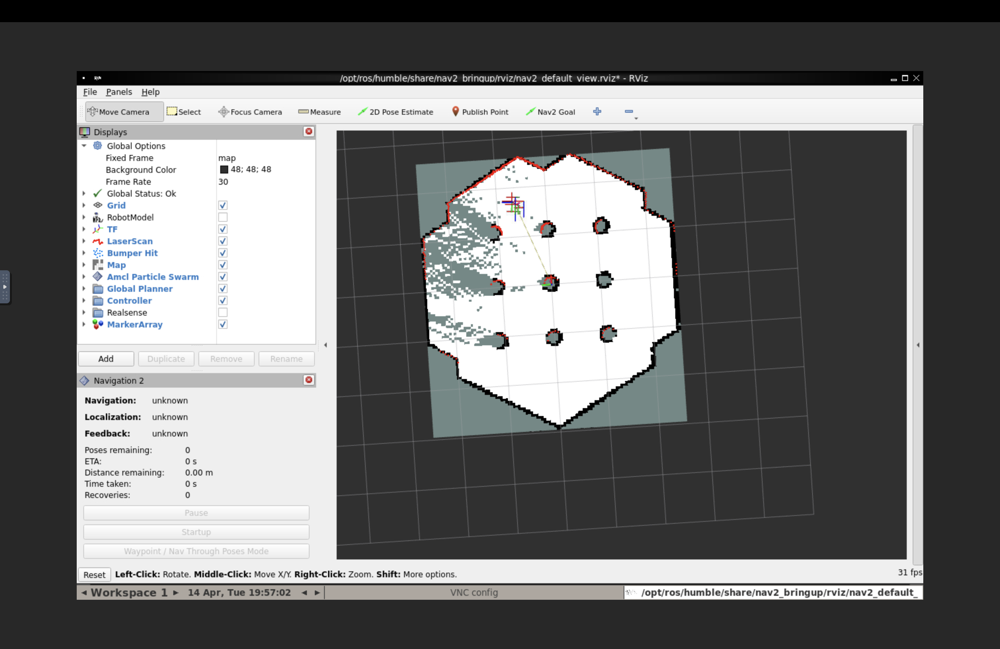
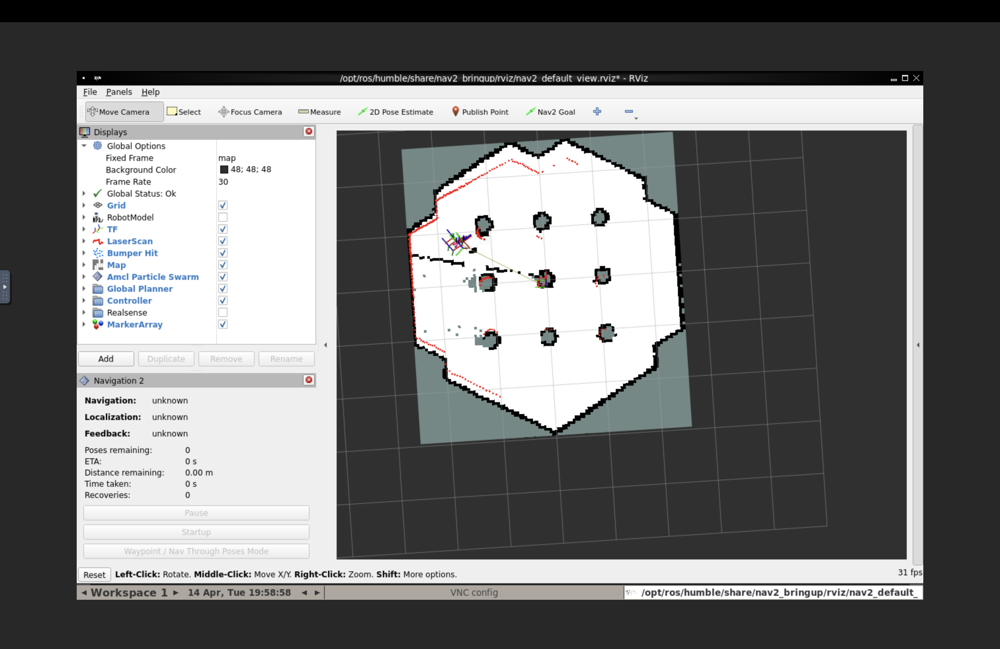

# MD25010 — ROS2 SLAM

Intern onboarding task for grant project MD25010 at New Uzbekistan University. The task was basically to get a full SLAM + autonomous navigation pipeline running using ROS2 and Nav2, using a TurtleBot3 in Gazebo simulation.

---

## Requirements

- Docker Desktop
- If you're on Apple Silicon, go to Docker Desktop → Settings → General and enable **"Use Rosetta for x86/amd64 emulation"**. Without this Gazebo just crashes.

---

## How to run

```bash
cd PartA
docker-compose build
docker-compose up -d
```

Then open `http://localhost:8080/vnc.html` in your browser, password is `password`. That gives you the desktop where Gazebo and RViz will show up.

Once the container is up, build the ROS2 package first:

```bash
docker exec -it md25010_ros2 bash
cd /root/ros2_ws
colcon build --packages-select md25010_nav
source install/setup.bash
export TURTLEBOT3_MODEL=waffle
```

### Part B - build the map

```bash
ros2 launch md25010_nav slam.launch.py
```

Brings up Gazebo, SLAM Toolbox in lifelong mapping mode, and RViz. In a second terminal:

```bash
ros2 run turtlebot3_teleop teleop_keyboard
```

Drive around until the map in RViz looks complete, then save it:

```bash
ros2 run nav2_map_server map_saver_cli -f /root/ros2_ws/maps/turtlebot3_map
```

### Part C - autonomous navigation

Kill the SLAM terminal first. Then:

```bash
ros2 launch md25010_nav full_stack.launch.py
```

Either use the 2D Goal Pose tool in RViz manually, or run the goal sequence:

```bash
ros2 run md25010_nav send_nav_goals
```

Results get saved to `/root/ros2_ws/maps/nav_goals_log.csv`.

---

## Repo layout

```
PartA/
  Dockerfile                  - container setup
  docker-compose.yml          - ports, volumes, display config
  maps/                       - mounted into the container at /root/ros2_ws/maps
  src/md25010_nav/            - the ROS2 package (colcon build goes here)
    launch/                   - slam.launch.py, nav2_amcl.launch.py, full_stack.launch.py
    config/                   - slam_params.yaml, nav2_params.yaml
    maps/                     - map files bundled with the package
    md25010_nav/send_nav_goals.py

PartB/
  maps/                       - turtlebot3_map.pgm + .yaml
  screenshots/                - RViz screenshots from map building

PartC/
  scripts/send_nav_goals.py   - original standalone version
  results/nav_goals_log.csv   - 5 goals, all SUCCESS
```

---

## Screenshots

**Map building progress**





**Autonomous navigation**


---

## Navigation results

5/5 goals reached:

| goal | x, y | time | arrival error |
|------|------|------|---------------|
| goal_1 | 1.5, 0.0 | 135s | 0.04m |
| goal_2 | 1.5, 1.5 | 61s | 0.07m |
| goal_3 | -1.0, 1.5 | 33s | 0.03m |
| goal_4 | -1.0, -1.0 | 78s | 0.11m |
| goal_5_home | 0.0, 0.0 | 39s | 0.05m |

---

## Things worth knowing

- `LIBGL_ALWAYS_SOFTWARE=1` is set in the Dockerfile because there's no GPU in Docker, Gazebo needs software rendering
- The docker-compose mounts `PartA/maps` into the container so saved maps persist between runs
- `models.gazebosim.org` is blocked in `/etc/hosts` inside the container — Gazebo tries to fetch models from the internet on startup and hangs if you don't do this
